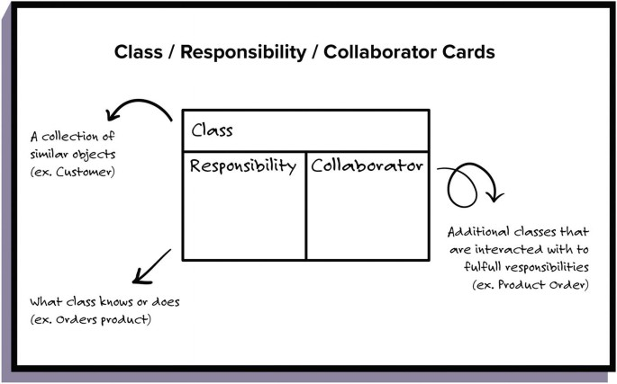

# Object-Oriented-Design

-  The software designer role would be responsible for outlining a software solution to a specific problem by designing the details of individual components and their responsibilities.

- A software architect role would be responsible for looking at the entire system and choosing appropriate frameworks, data storage, solutions and determining how components interact with each other. That brings us to the primary difference between software design and software architecture. In short, software design looks at the lower level aspects of a system, whereas software architecture tends to look at the bigger picture, the higher level aspects of a system

- Great software designers and architects are detail-oriented, forward thinkers. They need to be able to see the product at both the low and high levels.

## [Object Oriented Design Course Note](https://d3c33hcgiwev3.cloudfront.net/_3cef0bd88cf5c57529dba8223c1d8890_Object-Oriented-Design_Course-Notes.pdf?Expires=1679097600&Signature=O4GX6YsDpHodGb15zVMFj7z794rrTQjNcGnzaa7BQm1a9oT~NCPpdgBxDoHclNYcush7d2KHeEFZtdcfyoB4cPX68ey8ry~xgjnfeejogWh5b~6yXi~LHmhTAWbAdx~8UiEcH6ZwBO0KqWgVVNxDeGe06CYAYuik5mDvK0UhwzI_&Key-Pair-Id=APKAJLTNE6QMUY6HBC5A)

## [Course Glossary](https://d3c33hcgiwev3.cloudfront.net/_b14d4a2c530a055edc0682adba01da1d_C1-Glossary.pdf?Expires=1679097600&Signature=Esdqec2TWqVUeEMF-X-0QLn~YQKx19W4anflLeNAkVfEK4OxJrh-uUrixJ4YAqmnNLNbZoIC~10rdx122788ryiWstQuBtj3ewx-drn-AMC7qlDaFDaVWJpW5v53NDHANGDjnllLbGTilscxB9rn0CE11s0WTsSO4Zv5~RQYa~o_&Key-Pair-Id=APKAJLTNE6QMUY6HBC5A)

# [Week 1](https://www.coursera.org/learn/object-oriented-design/home/week/1)

## Object-Oriented Thinking

### Object-Oriented Modeling

- When solving a problem, object-oriented modeling involves the practice of representing key concepts through objects in your software. Depending on the problem, many concepts, even instances of people, places or things become distinct objects in the software

- It keeps code organized by having related details and specific functions in distinct, easy to find places. This creates flexibility because you can easily change details in a modular way without affecting the rest of the code. You can also reuse code and keep your program simple.

### Example
- Let's explore what object-oriented modeling might look like. Consider the seminar room for example. The first object we identify is the room itself. The room has details such as the room number and the seating capacity of the room. We can also identify objects that are contained within this room. What are some of these objects? Have a look around this room. There are many physical objects such as the chair, the table, the projector and the white board. Each of these physical objects could be represented by objects in software. There are specific details associated with each object. The projector has specs related to its performance such as resolution and brightness....

## Design in the software process

### Software Requirements, Conceptual and Technical Designs

- You can think of developing software as a process that takes a problem and produces a solution involving software. Normally, it's an iterative process, with each iteration taking a set of requirements through to a working and tested implementation and eventually building up a complete solution

- you will see the importance of requirements and design for a successful software solution. We will cover how eliciting requirements involves actively probing a client's vision, by asking questions about issues that the client may not have considered. Besides identifying specific needs, you learn to ask about potential trade offs the client will need to make in the solution. With a clear idea of what you are trying to accomplish, you can pivot to Conceptual Design mock ups and eventually, Technical Design diagrams.

- You may be eager to tackle implementation work and get something working, but the requirements and design activities are critical. Once you begin coding a solution and depend on certain assumptions, it can become difficult to change those assumptions. For the design phase, you will have to think like an architect, which means thinking about the structure and behavior of your software

- The design activity involves taking requirements and outlining a solution. This activity involves producing a conceptual design and then a technical design, which results in two corresponding kinds of artifacts, conceptual mockups and technical diagrams.

- After the conceptual mockups are done, it is time to define the technical details of the solution. From the conceptual design, you know all the major components and connections and their associated responsibilities. Describing how these responsibilities are met is the goal of technical design. In a technical design, you start specifying the technical details of each component. This is done by splitting components into smaller and smaller components that are specific enough to be designed in detail

- By breaking down components more and more into further components, each with specific responsibilities, you get down to a level where you can do a detailed design of a particular component, such as, describing how to reinforce the floor. Technical diagrams express how to address specific issues like this. Compromises might arise when creating an acceptable solution

- Constant communication and feedback is key, so that the solution is acceptable. If components and connections and their responsibilities in your conceptual design prove impossible to achieve in the technical design. Or fail to meet the requirements, you will need to go back to your conceptual design and rework it. Once you come to a feasible design, you want to continuously check with your client that the conceptual mockups capture what they want. In the architectural example, such checks are important. Because you'd rather adjust the design on paper than demolish an actual wall later. The technical diagrams then become the basis for constructing the intended solution.

- From a conceptual design, we move to making a technical design where, just like building design, you try to add a detail how those components, connections and responsibilities can be implemented. For example, we refine each component until it is specific enough to be designed in detail.

- Components, when they are refined enough, turn into collections of functions, classes or other components. These pieces then represent a much simpler problem that the developers can individually implement. You can easily imagine that larger systems require more design time. With large systems, there are also more components, connections and responsibilities to keep track of. And since these components themselves will be bi, they will be refined to many more components before the design can be detailed.

## [Expressing Requirements with User Stories](https://d3c33hcgiwev3.cloudfront.net/_dd374195fd4bdd2f8a95b9ebc8409246_User-Stories.pdf?Expires=1679097600&Signature=YwV1s9LQ~O-j6STNYfpGyLaF7TMPmWK4qpsrfyRC23z4J-B2J3u2yPjZSjvleRYito--TYJLDzJkPih6cQ-04LvGQVnEYsoXUATeTIIcz95oiQVVyu~5Sn1F6ySnNLP5lQZPY6A~Uw9Et3ZAzUwwWJEePGkS054Nb2e76yUMogg_&Key-Pair-Id=APKAJLTNE6QMUY6HBC5A)
  
## [Categories of Objects in Design](https://d3c33hcgiwev3.cloudfront.net/_12fa1381f24f1477da387de9693313da_Categories-of-Objects.pdf?Expires=1679097600&Signature=gFYHe3fWF2in5A~I0SbMGG7K66H5tuPf~-qTqjwkLeSPDyhz6PNes9ikET3POaT6cpi7ob3nLKmsEBv27JCCrn68pByp3Q~xRYHu4LGFNyj82tIiyXc4XhQuPG4mTiJx8j7SrtrrKnemIE9D4hAjV6JYw7h69QzjgxmIyNUn7ms_&Key-Pair-Id=APKAJLTNE6QMUY6HBC5A)

# Class Responsibility Collaborator (CRC)
- You identify components, connections and responsibilities from some requirements when forming the conceptual design. This is where you give your initial thoughts on how you might satisfy the requirements. In the technical design, you learned how these components and connections are further refined to give them technical details. This makes them easier to implement. Although identifying components, their responsibilities and connections, is a good first step in software design, we haven't yet demonstrated a way of representing them.

- This technique uses CRC cards where CRC stands for Class, Responsibility, Collaborator. Similar to how note cards help you organize your talking points, CRC cards help you to organize your components into classes, identify the responsibilities and determine how they will collaborate with each other. 

 
  

# [Week 2](https://www.coursera.org/learn/object-oriented-design/home/week/2)

## Creating Models in Desing

### Bridging Concepts and Solutions

- There are design strategies in programming languages suited for solving certain kinds of problems. If you had a data processing problem

- **Top Down Programming** This strategy map the processes in the problem to routines to be called. As you broke down the processing needs top down, you made a tree of routines for the eventual solution. These routines would be implemented in a programming language that supported subroutines. To make design easier, you don't want a big mental jump during design work between a concept in the problem space and how to deal with it in the solution space. If these concepts could be described in a design that made sense to both users and developers. you still don't go straight from the problem to writing the code. There's a conceptual design involving object-oriented analysis to identify the key objects in the problem. There's also technical design involving object-oriented design to further refine the details of the objects, including their attributes and behaviors. The design activities happen iteratively and continuously.
    
- **Models** && **Entity** These models are useful throughout the design process. Initially, the focus will be on the entity objects from the problem space. As a solution in software arises, you introduced control objects that receive events and coordinate actions.
 
- **boundary** You also introduce boundary objects that connect to services outside your system.
  
- **UML** The models are often expressed in a visual notation called Unified Modeling Language or UML. In Object-Oriented Modeling, you have different sorts of models or UML diagrams to focus on different software issues, like a structural model, to describe what the objects do and how they relate. It's like having a scale model of a building to understand the spatial relationships. To deal with complexity, you can apply design principles and guidelines to simplify objects. Break them down into smaller parts and look for commonalities that can be handled consistently.

## Four Design Principles

1- **Abstraction**
- Abstraction is one of the main ways that humans deal with complexity. Abstraction is the idea of simplifying a concept in the problem domain to its essentials within some context. Abstraction allows you to better understand a concept by breaking it down into a simplified description that ignores unimportant details.
    
- [**Rule of Least Astonishment**](https://en.wikipedia.org/wiki/Principle_of_least_astonishment) That is, the abstraction captures the essential attributes and behavior for a concept with no surprises and no definitions that fall beyond its scope. You don't want to surprise anyone trying to understand your abstraction with irrelevant characteristics.
    
- Within the context of an abstraction, anything other than a concept's essential attributes and behaviors is irrelevant. When considering our student in the context of an academic setting, we don't care whether the student has a pet or how they clean their kitchen or what their favorite video game is. Those are all irrelevant details to the abstraction in this context. Whenever we make abstractions, we need to remember our context. If the context changes, the right abstraction can as well.
    

2-   [**Encapsulation**](https://www.coursera.org/learn/object-oriented-design/lecture/cFBE5/1-2-4-encapsulation)
- Encapsulation is a fundamental design principle in object oriented modeling and programming.
    
- Encapsulation involves three ideas. As the name suggests, it's about making a sort of capsule.
    - The capsule contains something inside, some of which you can access from the outside, and some of which you cannot. First, you bundle attribute values or data, and behaviors or functions, that manipulate those values together into a self-contained object. 
        
    - Second, you can expose certain data and functions of that object, which can be accessed from other objects. 
        
    - Third, you can restrict access to certain data and functions to only within that object.
        
- Encapsulation forms a self-contained object by bundling the data and functions it requires to work, exposes an interface whereby other objects can access and use it, and restricts access to certain inside details. 
    
- Encapsulation helps with data integrity. You can define certain attributes and methods of a class to be restricted from outside to access.
    
-  Encapsulation can secure sensitive information. For example, you may allow a student class to store a degree program and grade point average, GPA. The student class itself could support queries involving the GPA, without necessarily revealing the actual value of the GPA. For example, the student class could provide a method that tells whether the student is in good standing for the degree program, which uses the GPA and the calculation, but never reveals its actual value.
    
    
3- **Decompostion**

-  it's important to keep in mind the design principles work well together.
    
- Decomposition is taking a whole thing and dividing it up into different parts. Or, on the flip side taking a bunch of separate parts with different functionalities, and combining them together to form a whole. Decomposition allows you to further break down problems into pieces that are easier to understand and solve.
    
- A whole might have a fixed or dynamic number of a certain type of part. If there is a fixed number, then over the lifetime of the whole object it will have exactly that much of the part object.
    
- There are sometimes parts with a dynamic number. Meaning, the whole object may gain new instances of those part objects over its lifetime.
    
- because of encapsulation, the instrument panel treats the instruments like black boxes, and doesn't care about how they are implemented. One issue in decomposition involves the lifetimes of the whole object, and the part objects, and how they could relate. Lifetimes might be closely related.
    

4- **Generalization** 

- Generalization, helps us to reduce the amount of redundancy when solving problems.
    
- Many behaviors and systems in the real world operate through repetitious actions.
    
- We can model behaviors using methods. It lets us generalize behaviors and it eliminates the need to have identical code written throughout a program.
    
- Generalization is frequently used when designing algorithms, which are meant to be used to perform the same action on different sets of data. We can generalize the actions into its own method, and simply pass it through a different set of data through arguments.
    
- Generalization happens to be one of the main design principles of object-oriented modeling and programming.
    
- Generalization can be achieved by classes through inheritance.
    
- Inheritance and methods exemplify the generalization design principle. There are techniques that left us apply a rule called D.R.Y., which stands for Don't Repeat Yourself.
    

